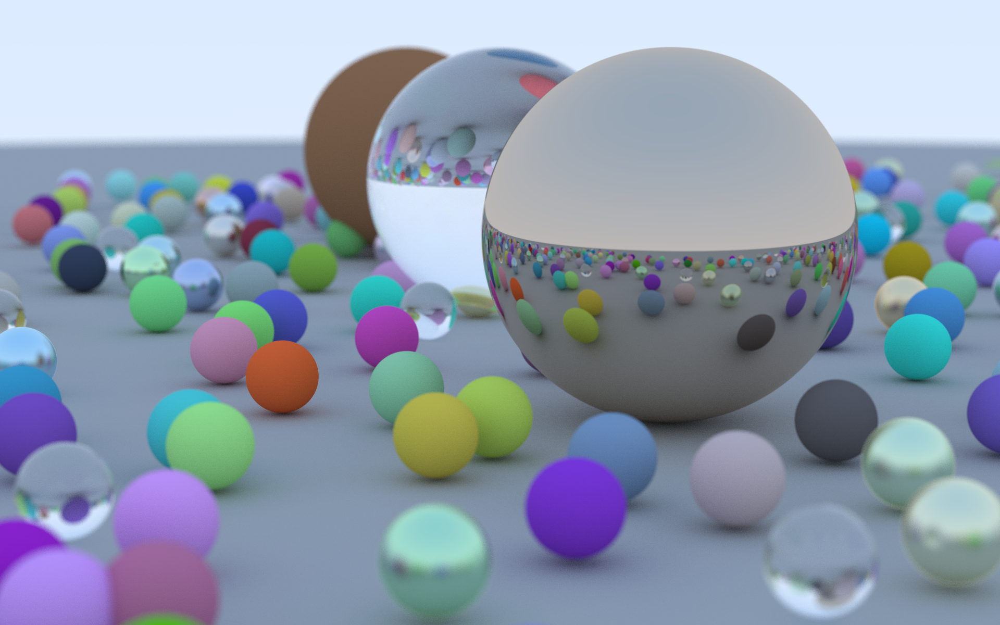

# Simple raytracer in Go

A basic implementation of [Ray Tracing in One Weekend](https://raytracing.github.io/books/RayTracingInOneWeekend.html) by Peter Shirley in Go

I wrote it in C++, Rust and Go as a learning exercise and to compare the languages.

## Dependencies

Go compiler version 1.19 and up

## Compile and Run

```sh
go build
```

Run

```sh
time ./raytracer simple > test.ppm
```
